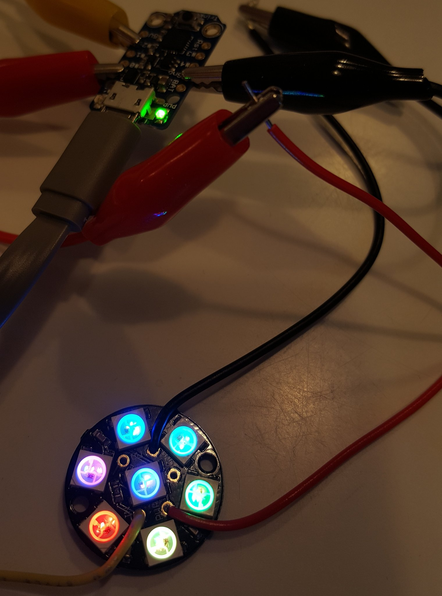
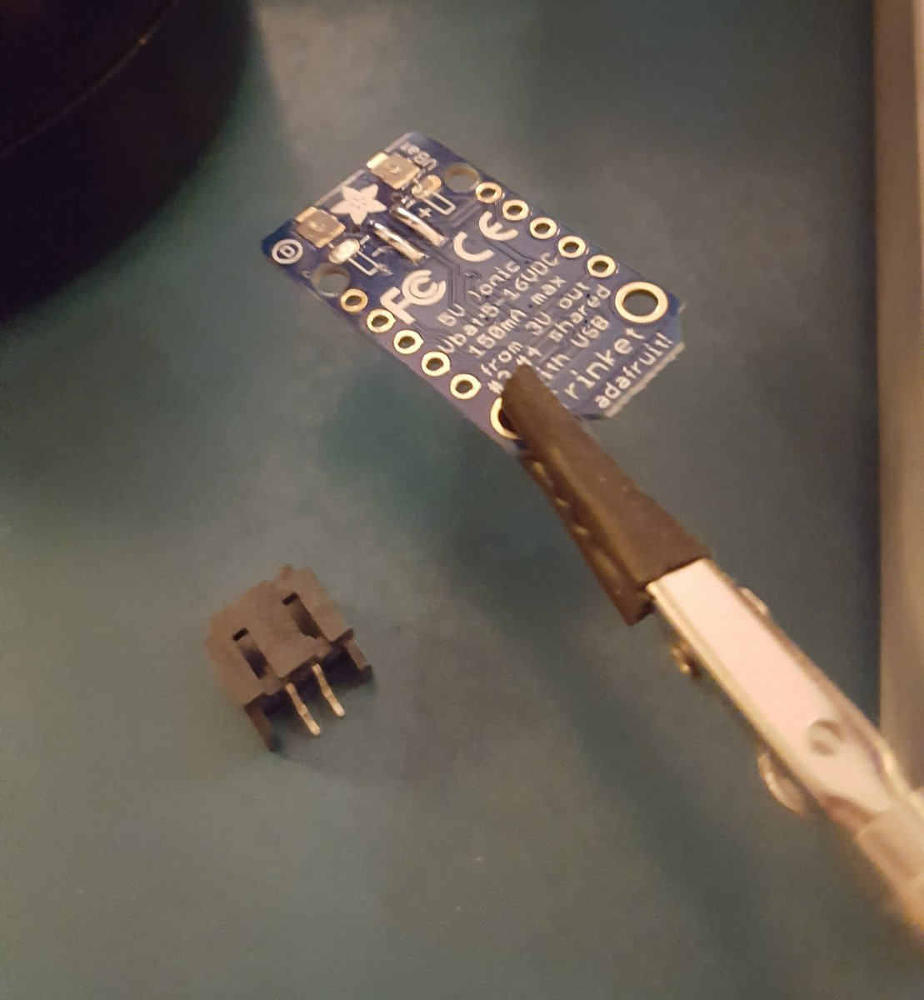
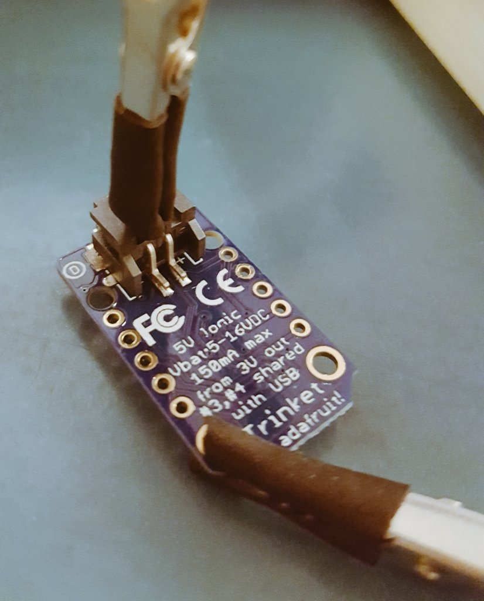
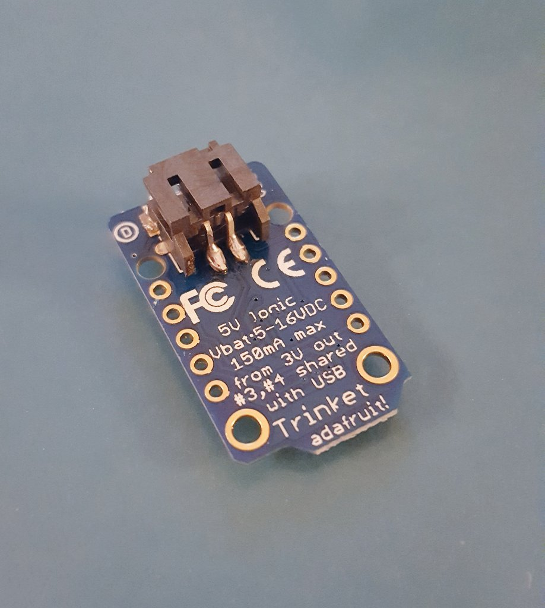

# Adafruit Trinket +  Neopixel Ring

##### An arduino wearable fashion tech project

### Materials:

- [Adafruit Trinket Mini 5V](https://www.adafruit.com/product/1501)
- [Neopixel Jewel](https://www.adafruit.com/product/2226)
- [LiPo 105mAh Battery]()
---
### Wiring Diagram:

---

### Build Process:

1. I checked the Adafruit Trinket first by uploading the convenient [Blink!](https://learn.adafruit.com/introducing-trinket/setting-up-with-arduino-ide) test code to the Trinket using the Arduino IDE.

2. I soldered the data, ground, and power wires to the Neopixel Jewel.

3. I uploaded the `trinket_ring.ino` code to the Trinket. I attached the wires from the Neopixel Jewel to the Adafruit Trinket using alligator clips.

  

4. In order to power the Adafruit Trinket with a LiPo battery pack, it was necessary to solder a JST connector to the back of the Adafruit Trinket.

  This soldering technique is a bit more advanced and called Solid Mount Soldering, because you are solid 2 pieces directly together.

  - Step 1: Tin the connection points on the Adafruit Trinket

    

  - Step 2: Secure the JST connector and reheat the previously soldered connections to fuse them.

    

  - Step 3: Add a bit more solder to ensure good connection. And voila!

    

5. Connect the battery, attach the Neopixel Jewel again with alligator clips to ensure it's all powered and working.

6. Assemble: WIP
---
Made with 💚💙💜 by [Stephanie](https://stephanie.lol)
